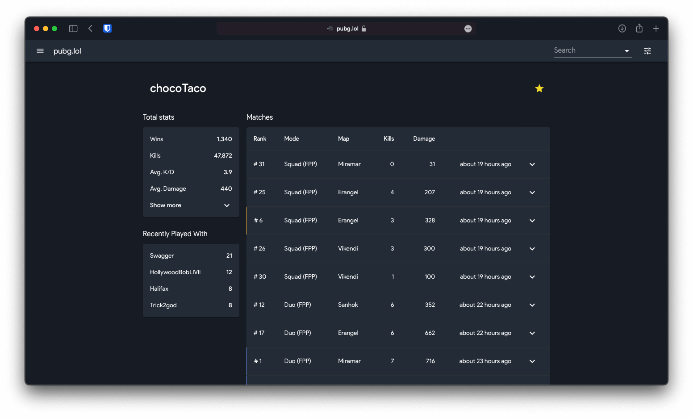

<p align="center">
  <p align="center">:baby_chick: :hatched_chick: :hatching_chick:</p>
  <h3 align="center">pubg.lol</h3>
  <p align="center">simple and clean pubg player stats and matches tracker<p>
</p>

<p align="center">
  
</p>

### Preview

The current procution build is served by vercel.com

```http
https://pubg.lol
```

the server is running on heroku

```http
https://api.pubg.lol
```

## Production

> info: **If you are using mobile browser**: Be very careful here!

install all necessary dependencies (node_modules)

```
$ yarn
```

```
$ yarn build:frontend
```

build application

```
$ yarn build:frontend
```

## Test (coming soon)

make sure the build process of app is working

```
$ yarn build:frontend
```

## Commands

import player

```bash
yarn workspace pubg-server ts-node --transpile-only ./src/tasks/importplayer.ts *PLAYER_NAME*
```

update players + matches

```bash
yarn workspace pubg-server ts-node --transpile-only ./src/tasks/updateplayers.ts *UPDATE_INTERVAL optional*
```

run tasks on heroku

```bash
heroku run importplayer *PLAYER_NAME* --app pubg-app
heroku run updateplayers --app pubg-app
```

## License

Copyright (c) 2020 [Dominic Kolbe](https://dominickolbe.dk)
